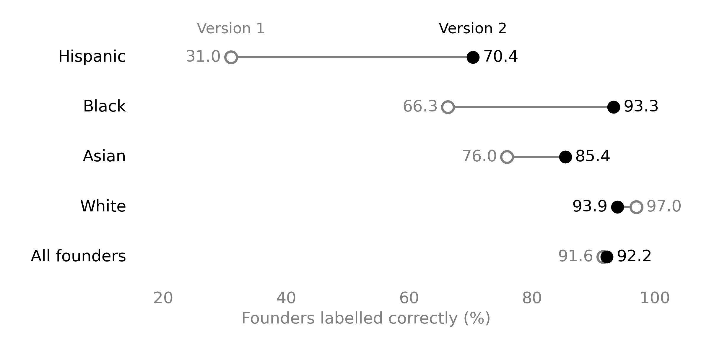

# race_classifier_v2

Predicts a 4-class race/ethnicity label (White, Asian, Black, Hispanic) for each person from **their name and a
photo of their face**. It replaces `race_classifier_fbhgs.py` (DeepFace + census surname lookup + random forest)
and takes the same input. On a held-out test set it has the same overall accuracy as the old pipeline (92.2% vs
91.6%) and is much more accurate on the minority classes: Black 66% → 93%, Hispanic 31% → 70%, Asian 76% → 85%.
See [results/](results/).

Developed by Emmanuel Yimfor. This is version 2 of the classifier I introduced in "Funding Black High-Growth
Startups" (Cook, Marx, and Yimfor, Journal of Finance, 2026). If you use it, please cite that paper (see
[Citation](#citation)).

## What is new in version 2

Both versions use a person's name and a photo of their face. Version 2 changes how each one is read.

| | Version 1 (`race_classifier_fbhgs.py`) | Version 2 (this folder) |
|---|---|---|
| Name | Surname only, looked up in Census surname tables | First and last name together, scored by ethnicolr2 |
| Face | DeepFace's built-in race model | Built on FairFace, in the three steps below |
| Final label | Random forest | LightGBM model trained on 128,612 labelled founders |
| Accuracy: Black / Hispanic / Asian | 66% / 31% / 76% | 93% / 70% / 85% |
| Accuracy: overall | 91.6% | 92.2% |



The figure shows the share of founders each version labels correctly, on 25,723 labelled founders held out from
training.

How version 2 reads a face:

1. **Crop.** The face is found and cropped the way FairFace does it.
2. **Describe.** SigLIP2, a general-purpose image model from Google, turns the cropped face into a list of
   numbers that describe what the image looks like. SigLIP2 knows nothing about race.
3. **Label.** A small classifier was trained on FairFace's labelled faces to read SigLIP2's numbers and output
   race probabilities.

The name scores and the face scores then go into the final model, which gives one label per person.

## Usage

```bash
python race_classifier_v2.py input_folder/ output_folder/
python race_classifier_v2.py input_folder/ output_folder/ --sort              # also copy images into output_folder/<label>/
python race_classifier_v2.py input_folder/ output_folder/ --model unweighted  # the other combiner, see below
```

`input_folder/` holds images named `firstname_lastname_id.jpg` (the old package's convention). Everything
between the first token and the numeric id is used as the surname, so `maria_de_la_cruz_123.jpg` → first name
`maria`, surname `de la cruz`. A stem with a single name token (`kenma_123.jpg`) is used as a surname with an
empty first name.

Output in `output_folder/`:

| file | contents |
|---|---|
| `race_predictions.csv` | `filename, first_name, last_name, prob_white, prob_asian, prob_black, prob_hispanic, predicted_label, basis` (`name+image`, or `name_only` when the image file could not be read) |
| `race_features.csv` | the 9 combiner inputs per image, plus `face_detection` (`cnn` = face found, `none` = no face so the whole image was used, `error` = unreadable file) |
| `white/ asian/ black/ hispanic/` | only with `--sort`: copies of the images, grouped by predicted label |
| `unreadable/` | only with `--sort`: image files that could not be read (`basis=name_only`) |

Other options: `--names names.csv` (columns `filename,first_name,last_name`) uses real names instead of parsing
them from filenames. `--batch N` sets the SigLIP2 batch size (default 16).

## Pipeline

1. **Name parsing.** First and last name are taken from the filename (or from `--names`).
2. **ethnicolr2** (`pred_fl_full_name`, a character-level LSTM trained on Florida voter registration data) gives
   4 probabilities (`nh_white, asian, nh_black, hispanic`) and a flag set to 1 when there is no prediction or
   the top class is "other". That makes 5 features.
3. **SigLIP2** (`google/siglip2-so400m-patch14-384`). A FairFace-style face crop is made (dlib CNN detector,
   largest face, 300 px, padding 0.25; the whole image is used if no face is found) and embedded with SigLIP2.
   A logistic-regression probe trained on FairFace (`models/siglip2_probe.joblib`) predicts 7 races, which are
   collapsed to 4: white = White + Middle Eastern, asian = East + Southeast Asian + Indian, black, hispanic.
   That makes 4 features.
4. **Combiner.** A LightGBM classifier takes the 9 features and outputs the final 4 probabilities. The predicted
   label is the most probable class. It was trained on 128,612 labelled founders.

## Two combiner models

About four in five founders in the training data are White. A model trained the plain way learns to guess White
when it is unsure, and it misses most Hispanic founders. So I trained the default model to treat a mistake on a
founder from a smaller group as more costly. A wrong label on a Hispanic founder counts about six times as much as
a wrong label on a White founder. For a Black founder it is about five times, and for an Asian founder about two
and a half times. The second model has no such weights.

| Group | Share of training founders | Weight | Cost of one mistake, relative to White |
|---|---|---|---|
| White | about 81% | 0.556 | 1.0 |
| Asian | about 13.5% | 1.361 | 2.4 |
| Black | about 3.1% | 2.826 | 5.1 |
| Hispanic | about 2.4% | 3.215 | 5.8 |

The weights come from the size of each group. Weighting each group by one over its size would make every group
count the same in total, but then one Hispanic founder would count like about 33 White founders, and too many
White founders would be pushed into the wrong group. I took the square root of that instead, which brings 33 down
to about 6. It is a middle setting: enough to find founders from the smaller groups, without giving up much
accuracy on the largest one.

| | `combiner_model.joblib` (**default**, `--model sqrt-balanced`) | `combiner_model_unweighted.joblib` (`--model unweighted`) |
|---|---|---|
| Training | classes weighted by sqrt(n / (4 · class count)) | no class weights |
| Test accuracy: white / asian / black / hispanic | 93.9 / 85.4 / 93.3 / 70.4% | 97.2 / 83.2 / 90.4 / 29.9% |
| Overall / macro avg | 92.2% / 85.8% | 93.5% / 75.2% |
| Use it for | **per-person labels**: finds far more minority founders | **group counts and shares**: predicted class totals are close to the true ones |

The trade-off: the weighted default labels more people as minority classes than really belong to them. Many
of them are White founders labelled Hispanic, so Hispanic precision is 38% (vs 56% for unweighted). Its
probabilities are also shifted toward the minority classes. If you sum labels or probabilities to estimate
population shares, use `--model unweighted`.

## Setup

On Linux with an NVIDIA GPU, one command builds the environment I tested:

```bash
PYTHONNOUSERSITE=1 conda env create -f environment.yml
conda activate race_v2
```

On a login node without a GPU, put `CONDA_OVERRIDE_CUDA=12.0` in front of the first command. The environment
takes about 9 GB of disk.

On Windows without a GPU, this is what worked on my desktop, using [uv](https://docs.astral.sh/uv/):

```powershell
uv venv --python 3.11 venv
uv pip install --python venv\Scripts\python.exe -r requirements-windows.txt
venv\Scripts\python.exe race_classifier_v2.py input_folder\ output_folder\
```

It runs, but it is slow: 100 images took about 80 minutes on my desktop, against under 2 minutes on a GPU node.

On other machines, install the packages yourself:

```bash
python -m venv venv && source venv/bin/activate     # Python 3.11/3.12
pip install -r requirements.txt                     # dlib: or `conda install -c conda-forge dlib`
```

On the first run, two sets of weights download automatically through the Hugging Face cache (`~/.cache/huggingface`,
which you can move with `HF_HOME=...`):

- **SigLIP2**, about 4.5 GB.
- **ethnicolr2**, a few MB, pinned to a fixed revision of the `gojiberries/ethnicolr2` Hub repo. To fetch it ahead
  of time run `ethnicolr2_download_models`. To use a local copy, set `ETHNICOLR2_MODEL_DIR` to a folder containing
  `lstm_fullname.pt` and `pt_vec_fullname.joblib`.

**Hardware.** A GPU is strongly recommended. The original batch pipeline, which decoded images in parallel, ran
at about 11 images per second on an A40. This script decodes images one at a time, so expect it to be somewhat
slower. On CPU, expect several seconds per image. Peak resident memory is about 7 GB. On a cluster that caps
*virtual* memory, request about 32 GB or more, because CUDA and the 4.5 GB SigLIP2 weights reserve about 22 GB of
address space. A CUDA build of dlib (for example from conda-forge on a GPU machine) will **not** run without a
visible GPU. On CPU-only machines use the pip/CPU build.

**Check.** On 28 held-out test images, given the same names (`--names`), the script reproduced the features from
the original training pipeline (SigLIP2 probabilities within 0.002) and the same final label for all 28.

## Folder contents

```
race_classifier_v2.py      the end-to-end script
requirements.txt
environment.yml            conda environment for Linux with an NVIDIA GPU
requirements-windows.txt   packages for Windows without a GPU
models/
  combiner_model.joblib             LightGBM combiner, sqrt-balanced class weights (default)
  combiner_model_unweighted.joblib  LightGBM combiner, no class weights
  siglip2_probe.joblib              FairFace 7-race logistic-regression probe on SigLIP2 embeddings
  dlib/                             dlib face detector + 5-point landmark model (FairFace preprocessing)
results/
  RESULTS.md                 validation results, old vs new, feature importances, confusion matrices
  RESULTS_class_weights.md   unweighted vs sqrt-balanced vs balanced
  holdout/RESULTS_test.md    clean held-out TEST results (rows never used for any modelling choice)
  *.csv                      the same numbers as CSV
  accuracy_v1_v2.png         the figure above
```

## Notes and limitations

- The labelled founder data (160,765 images and `train_labels.csv`) is **not included** because it cannot be
  redistributed. The models were trained on it, so the accuracy figures describe founders with LinkedIn-style
  profile photos and may not carry over to other populations.
- **Unreadable image files** are still labelled, from the name alone: the image features are passed to the combiner as
  missing (NaN), and LightGBM follows the direction it learned for missing values from the 337 training founders
  without a usable image. With the image features of every validation row masked this way, the default model gets
  86.1% overall (Black 50.1%, Hispanic 66.3%), vs 91.9% with the image. These rows have `basis=name_only`, the run
  prints a warning listing them, and `--sort` puts them in `unreadable/`. ethnicolr2's own scores are calibrated
  to Florida voters, not to this population, so its argmax can disagree with the combiner's name-only label.
- The probe is trained on FairFace (CC BY 4.0). SigLIP2 is Apache-2.0. ethnicolr2 is MIT. The two files in
  `models/dlib/` come from Davis King's [dlib-models](https://github.com/davisking/dlib-models) (CC0).

## Citation

```bibtex
@article{cook2026funding,
title={Funding Black High-Growth Startups},
author={Cook, Lisa D. and Marx, Matt and Yimfor, Emmanuel},
journal={The Journal of Finance},
volume={81},
number={3},
pages={1619--1660},
year={2026},
doi={10.1111/jofi.70039}
}
```
